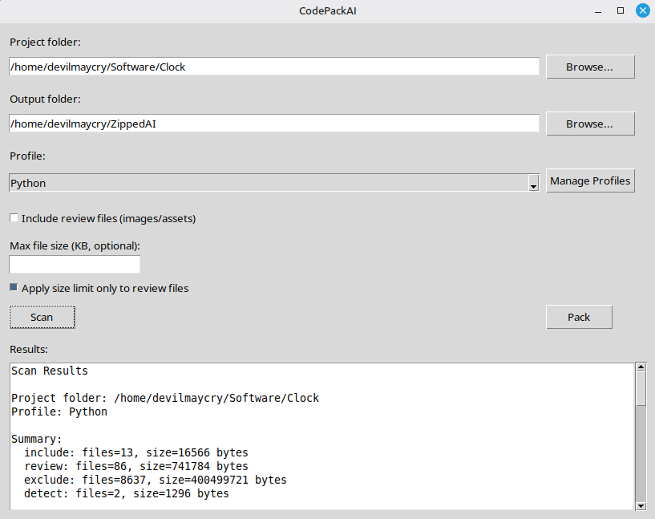

<p align="center">
  
</p>

---

##  CodePackAI

CodePackAI is a desktop application that scans a codebase and packages it into a clean, structured ZIP file optimized for AI analysis.

It allows you to define custom rules to include, exclude, or review files, making it easy to prepare projects for tools like ChatGPT, Gemini, or other AI systems with input size limitations.

Built with Python and Tkinter.

---

## Features

✔ Smart Project Scanning  
- Scans entire codebase recursively  
- Classifies files as include, exclude, or review  
- Rule-based filtering system  

✔ Custom Profiles  
- Create your own profiles for different tech stacks  
- Define rules per profile  
- Fully editable and reusable  

✔ Rule System  
- Match by extension, filename, folder, or path  
- Priority-based rule evaluation  
- Enable/disable rules dynamically  

✔ Import / Export Ready  
- Import rules from JSON files  
- Easily share and reuse configurations  

✔ AI-Optimized Packaging  
- Exclude unnecessary files (images, builds, caches)  
- Optional size filtering  
- Preserve project structure  

✔ ZIP Packaging  
- Generates clean ZIP archives  
- Includes only relevant files  
- Keeps folder hierarchy intact  

✔ Desktop Application  
- Simple and lightweight UI  
- No external dependencies required at runtime  
- Designed for fast workflows  

---

## Installation

Clone the repository:

git clone https://github.com/damir-bubanovic/CodePackAI.git  
cd CodePackAI  

Create and activate virtual environment:

python3 -m venv .venv  
source .venv/bin/activate  

Install dependencies:

pip install -r requirements.txt  

---

## Running the App

python main.py  

---

## How It Works

1. Create a profile  
2. Add or import rules  
3. Select your project folder  
4. Run scan  
5. Review results  
6. Pack into ZIP  

---

## Example Rule JSON

```json
{
  "rules": [
    {
      "rule_type": "include",
      "target_type": "extension",
      "pattern": ".py",
      "enabled": 1,
      "priority": 100
    },
    {
      "rule_type": "exclude",
      "target_type": "folder_name",
      "pattern": "__pycache__",
      "enabled": 1,
      "priority": 100
    }
  ]
}
```

---

## Project Structure

CodePackAI/  
│  
├── core/                  # Core logic (scanner, packer)  
│   ├── scanner.py  
│   ├── rule_engine.py  
│   ├── file_utils.py  
│   ├── packer.py  
│   ├── pack_filters.py  
│   └── zip_utils.py  
│  
├── services/              # Business logic (profiles, rules)  
│   └── profile_service.py  
│  
├── database/              # Database layer  
│   ├── connection.py  
│   └── schema.py  
│  
├── ui/                    # UI + handlers  
│   ├── main_window.py  
│   ├── main_window_handlers.py  
│   ├── profile_manager_window.py  
│   ├── profile_handlers.py  
│   └── rule_handlers.py  
│  
├── data/                  # SQLite database (app.db)  
├── images/                # App assets (screenshot)  
│  
├── main.py  
└── README.md  

---

## Notes

- No default profiles are included by design  
- Users create profiles manually for full control  
- Designed for preparing code for AI tools with size limits  
- Works best with structured rule sets per tech stack  

---

## Creator

Damir Bubanović  

GitHub: https://github.com/damir-bubanovic  

---

## License

MIT License